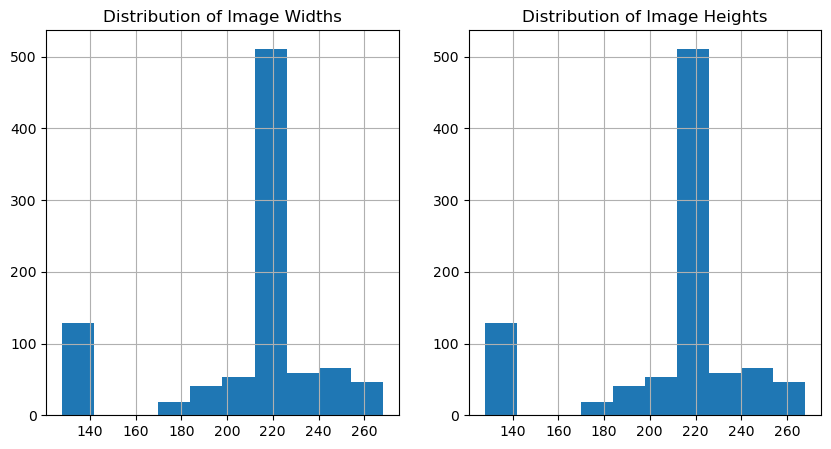
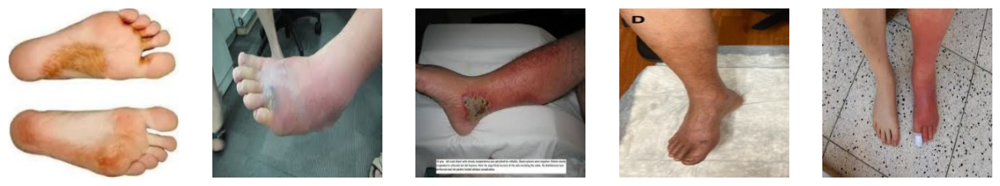
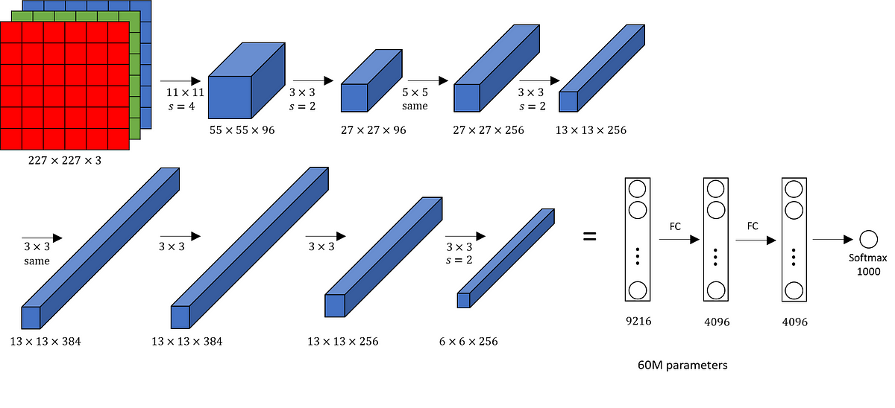
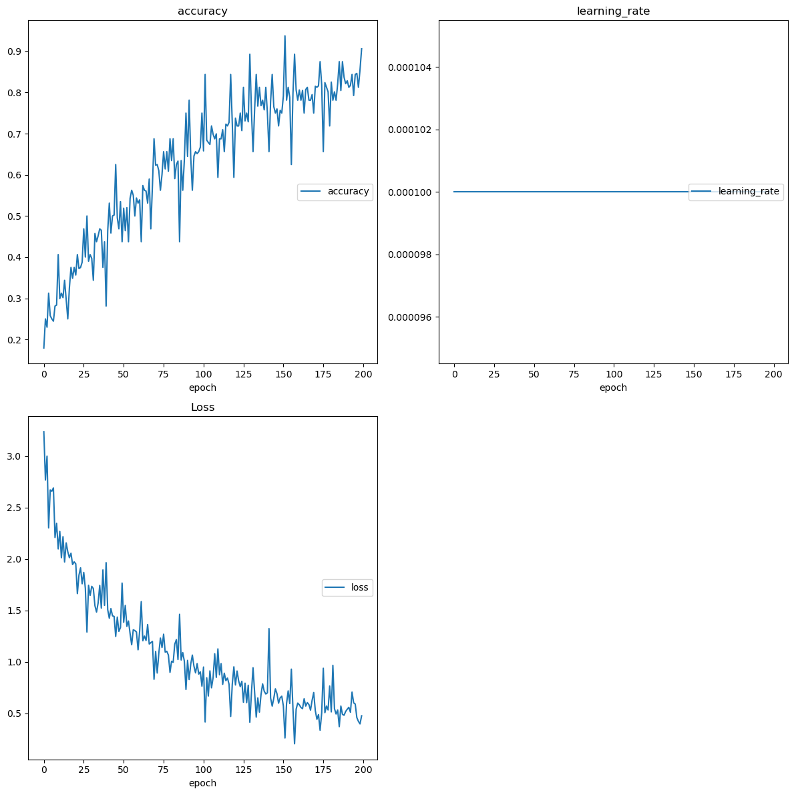
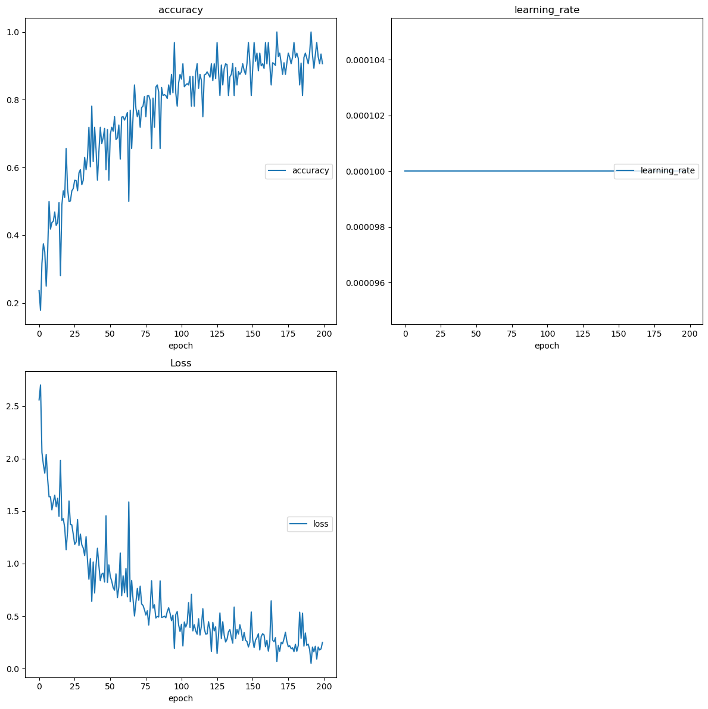
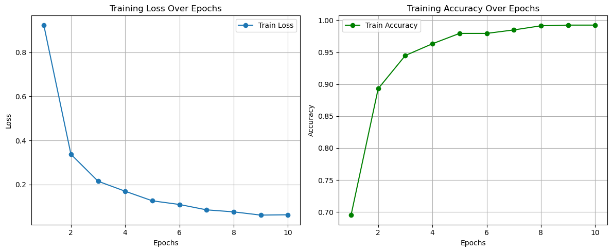

# Detecting Skin Infections using CNNs and Transfer Learning 

Aim : To be able to identify the different skin conditions that can be contracted in BJJ using deep learning

** Warning ** This repository contains graphic images of different skin infections that can be contracted. If you are squeamish, do not explore the data in this repository.

The objective of this work is to provide a foundation for a mobile app to help people who are reluctant to go to a doctor to identify the skin infections they may have contracted off the mats. 

## Exploratory Data Analysis

The dataset consists of 812 training images and 212 test images based on our dataset split. Notably, the height and width distributions are identical, indicating that all the images are square in shape. Additionally, all images are in RGB format, which is crucial since color differentiation is a key factor in distinguishing between various infections. For example, staph infections and ringworm can appear similar in terms of texture, but their color differences are essential for accurate identification.

From the EDA, it was observed that the samples of different skin infections were primarily taken from Caucasian skin (click to visualise below). A key consideration for this dataset is the lack of representation of skin diseases across other ethnic groups. It's important to note that the appearance of skin conditions can vary significantly on melanated skin compared to Caucasian skin. This underrepresentation introduces bias in our sample population, potentially limiting the model's ability to accurately learn and recognize the features of skin diseases in people of color. This issue reflects a broader problem within the medical field, where diversity in datasets is often lacking. Moving forward, a crucial recommendation would be to include a wider range of images reflecting skin diseases on different ethnic groups, particularly within public open-source repositories.

## Model A : Replication of the AlexNet model using Sequential API 

This implementation of AlexNet consists of **8 convolutional layers**, followed by a **feed-forward neural network**. We're using blank networks with **no pre-trained weights** to gain hands-on experience in building a deep neural network from scratch using the Tensorflow and Keras packages.

## Key Concepts:

1. **Convolutional Layers**:  
   These layers extract features from an image.  
   After each convolution operation (between image and filter/kernel), we apply **Batch Normalization**.

2. **Batch Normalization**:  
   This process normalizes the inputs by scaling them using their variance and mean.  
   It also applies an offset using the **scale** and **shift** parameters to improve network performance.

3. **Pooling Layers**:  
   Pooling layers **aggregate feature maps** by shrinking the image size.  
   This reduces computational complexity while retaining essential features.

4. **Feed-Forward Neural Network**:  
   After the convolutional layers, we have a fully connected feed-forward network.  
   To prevent overfitting, **Dropout layers** are used to regularize the predictions.

5. **Output Layer**:  
   The output layer is a **Softmax function** used for multiclass classification.  
   In this case, we are classifying multiple types of **skin infections**.

---

By building this network, we focus on understanding the inner workings of a deep neural network architecture, including how each layer contributes to the final prediction.

## Model A : Results

The code for Model A can be found in the model_A.ipynb notebooks located in the notebooks folder of this repository, functions have been fully annotated using doc strings thus enabling ease of understanding of the models contained within functions.

| Metric             | Value                      |
|--------------------|----------------------------|
| Train Accuracy      | 0.7316                     |
| Test Accuracy       | 0.7639                     |
| Train Loss          | 0.7845                     |
| Test Loss           | 1.0089                     |

As can be seen from the model metrics, the train and test accuracies are relatively low, and the gap between train and test loss is quite significant. This suggests that the model is **underfitting**, meaning it is not able to learn patterns effectively from the data provided. This underfitting could be caused by excessive regularization techniques, such as Dropout and BatchNormalization, which may be too aggressively constraining the model's learning capacity.

## Experiment 2 : Removing the dropout layers from AlexNet model

| Metric            | Value                      |
|-------------------|----------------------------|
| Train Accuracy     | 0.9242                     |
| Test Accuracy      | 0.8841                     |
| Train Loss         | 0.2163                     |
| Test Loss          | 0.6179                     |

Removing the dropout regularization layers, we find that the model drastically improves in being able to predict the class labels with a 3% discrepancy between test and training accuracy. The train loss and test loss indicate that while the model is fitting the training data well, there is still some overfitting occurring, as evidenced by the higher test loss compared to the train loss. This suggests that the model generalizes slightly less effectively on unseen data, despite the improved accuracy.

## Model A Conclusions 

The **AlexNet architecture** was implemented using the **TensorFlow/Keras** Python package. Two experiments were conducted, and their outcomes are summarized below:

- **Experiment 1**: AlexNet with Batch Normalization applied to the convolutional layers and Dropout applied to the fully connected layers.
- **Experiment 2**: AlexNet without Dropout applied to the fully connected layers.

## Results of Experiment 1:
In Experiment 1, we observed **underfitting** of the model, which was indicated by a noticeable difference between the test and training scores. This underfitting was attributed to two factors:

1. **No Pre-Trained Weights**:  
   Since the model was trained from scratch without pre-trained weights, it may not have had sufficient exposure to data to effectively learn complex patterns. Leveraging a pre-trained model could improve performance by providing a better starting point.

2. **Over-Regularization**:  
   The second hypothesis was that the model might have been **over-regularized** due to the combined use of Batch Normalization and Dropout. To test this, we proceeded to **Experiment 2**, where the Dropout layers were removed to evaluate their impact on the model's performance.

## Results of Experiment 2:
In Experiment 2, the removal of the Dropout layers resulted in a **marked improvement in accuracy**. However, the model still exhibited slight **overfitting**, as indicated by the discrepancy in the loss metrics between the training and test scores. This suggests that while the model's performance improved, it still struggled to generalize fully to unseen data.

## Conclusion:
Based on these findings, it was concluded that while removing Dropout improved accuracy, it was not sufficient to eliminate overfitting. To further optimize performance, a **pre-trained model** will be utilized as a benchmark to compare against these "fresh" models, potentially leading to better results in terms of both accuracy and generalization.

# Model B : Transfer Learning using a Pretrained AlexNet model via PyTorch Framework

The code for this experiment can be found in the model_B.ipynb file of the notebooks folder.

In this experiment, the same loss and optimizers were used (CrossEntropy Loss and Adam Optimizer) to enable comparisons to findings from Model A. Additionally, all layers except the output layer were frozen; in this instance, only the classifying layer is trained on the input data it receives.

Given this, we found dramatic improvements in the training loss and training accuracies with LESS epochs compared to the AlexNet-like models implemented in TensorFlow. This shows that a model with pretrained weights offers significant advantages in terms of both training efficiency and final performance.

### Key Rationale for Improvement:

1. **Transfer Learning**:  
   By using a model with pretrained weights, we take advantage of a network that has already learned rich feature representations from a large dataset, typically ImageNet. These pretrained layers can effectively extract general features such as edges, textures, and shapes, which are applicable across different tasks, reducing the need for the model to learn these from scratch.

2. **Frozen Layers**:  
   Freezing all layers except the final classification layer ensures that the pretrained features are retained and the model focuses only on learning the task-specific classification. This reduces the risk of overfitting, as fewer parameters need to be updated, particularly when working with smaller datasets.

3. **Faster Convergence**:  
   Since the model is already initialized with weights that are close to an optimal solution for feature extraction, the model converges faster during training. The classifying layer needs to adjust only to the specific task at hand, which explains the dramatic improvements in training loss and accuracy.

4. **Improved Generalization**:  
   Pretrained models tend to generalize better because they have been trained on diverse datasets. This allows the model to perform well on unseen data by transferring learned representations, leading to better test accuracy.

The use of pretrained weights significantly enhances both the training process and final model performance, especially when limited data is available for training. This shows the power of transfer learning in improving model performance with minimal training time and data.

## Performance Comparison of Different Models

| Model                     | Train Loss | Train Accuracy | Test Loss | Test Accuracy |
|----------------------------|------------|----------------|-----------|---------------|
| **Model A with Dropout**    | 0.7845     | 0.7316         | 1.0089    | 0.7639        |
| **Model A without Dropout** | 0.2163     | 0.9242         | 0.6179    | 0.8841        |
| **Model B**                 | 0.0502     | 0.9905         | 0.1797         | 0.9487         |

## Summary:

1. **Model A with Dropout**:
   - **Training Loss**: 0.7845
   - **Training Accuracy**: 73.16%
   - **Test Loss**: 1.0089
   - **Test Accuracy**: 76.39%
   - This model performs moderately well, with some overfitting as indicated by the higher test loss compared to training loss.

2. **Model A without Dropout**:
   - **Training Loss**: 0.2163
   - **Training Accuracy**: 92.42%
   - **Test Loss**: 0.6179
   - **Test Accuracy**: 88.41%
   - Removing dropout in Model A significantly improved both training and test performance, suggesting that the model generalized better without dropout.

3. **Model B**:
   - **Training Loss**: 0.0502
   - **Training Accuracy**: 99.05%
   - **Test Loss**: 0.1797
   - **Test Accuracy**: 95.3%
   - Model B shows excellent performance on the training set and achieves the highest test performance, suggesting that it is the best performer in terms of generalization.

## Conclusion:

- **Model B** is the best-performing model based on the available test accuracy. Showing it is the model the generalizes best for this task.

## Outlook

Going forward, **Model B** will be updated by training it on an extended dataset. Additionally, images of infections on darker skin tones will be included to allow for a more diverse representation of infections across different ethnicities.

Moreover, the codebase for **Model B** will be improved upon as I acquire a better grasp of the PyTorch framework. Lastly, I will explore integrating the model into a mobile app for in situ testing, enabling on-the-go diagnosis and analysis.

